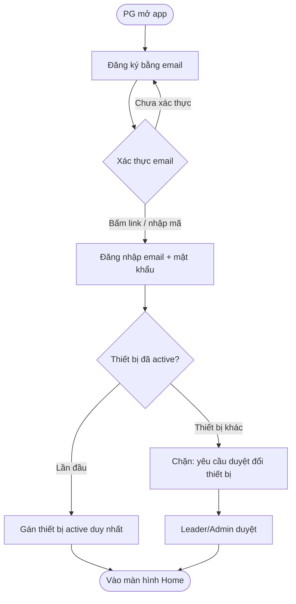
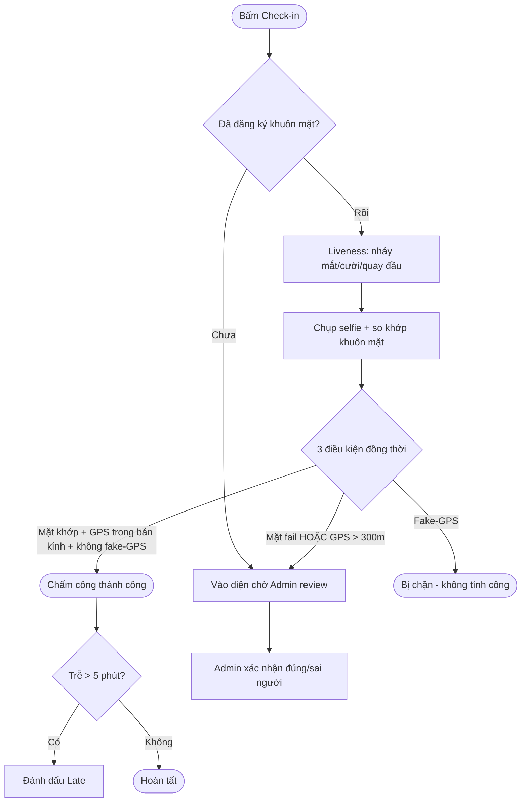
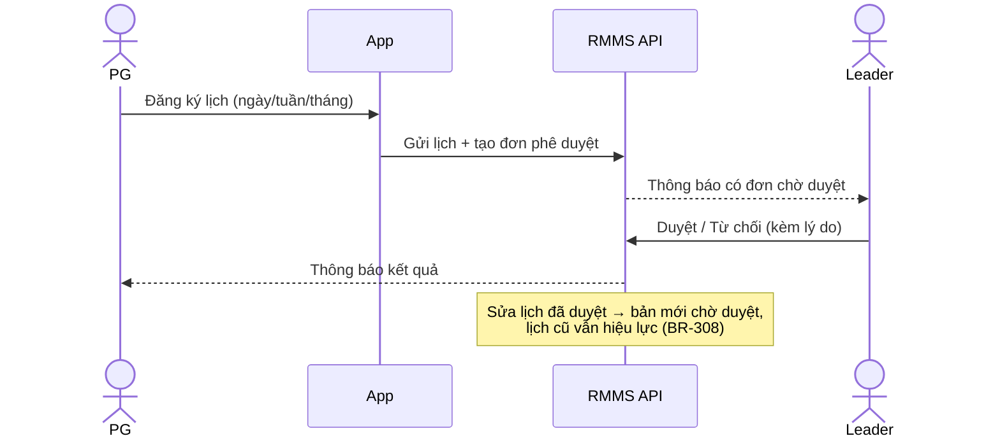
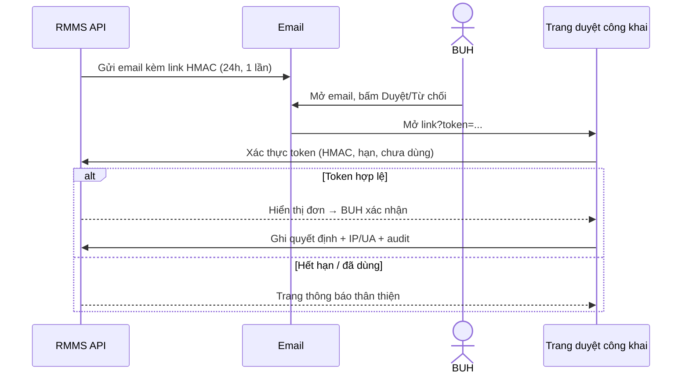
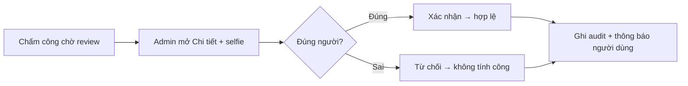

# Hướng dẫn sử dụng — RMMS 2026 (Phase 1A)

> **Bản nháp (draft)** hướng dẫn người dùng cho bản phát hành nội bộ Phase 1A. Chỉ mô tả các tính năng **đã giao** (xem [RELEASE-NOTES-Phase-1A.md](./RELEASE-NOTES-Phase-1A.md)). Form Engine, Visit Plan, Documents/Payslip, Product Master, News sẽ bổ sung ở Phase 1B.
>
> - **Cập nhật:** 2026-06-14
> - **Ứng dụng:** App di động (Flutter, iOS + Android) cho **PG** & **Leader**; Web (Next.js) cho **Admin** & **BUH**.
> - Sơ đồ luồng (mermaid) ở [§7](#7-sơ-đồ-luồng-mermaid).

---

## 1. Đối tượng & vai trò

| Vai trò | Viết tắt | Dùng app nào | Việc chính |
|---|---|---|---|
| Promotion Girl/Boy | **PG** | App di động | Chấm công, đăng ký lịch, đơn nghỉ/OT |
| Leader (quản lý PG) | **Leader** | App di động | Như PG + duyệt đơn, giám sát đội |
| Admin hệ thống | **Admin** | Web | Quản trị người dùng, review chấm công, audit |
| Business Unit Head | **BUH** | Web + email | Xem tổng quan, duyệt đơn (kể cả qua email) |

**Thuật ngữ:** *Store* = điểm bán (có GPS). *Shift* = ca làm theo ngày. *Check-in/Check-out* = bắt đầu/kết thúc chấm công. *Face Verification* = bước xác thực khuôn mặt.

---

## 2. Bắt đầu

### 2.1. PG đăng ký & đăng nhập (app)

1. Mở app → **Đăng ký** bằng email công ty.
2. Mở email → bấm link xác thực (hoặc nhập mã trong app).
3. Đăng nhập bằng email + mật khẩu.
4. Lần đầu đăng nhập → thiết bị này trở thành **thiết bị active duy nhất** của bạn.

> ⚠️ Mỗi PG chỉ dùng **1 thiết bị tại một thời điểm**. Đổi điện thoại cần Leader/Admin duyệt (xem [§3.6](#36-đổi-thiết-bị)).

### 2.2. Leader / Admin / BUH đăng nhập

- **Leader:** đăng nhập app như PG (không bị ràng buộc 1-thiết-bị).
- **Admin / BUH:** đăng nhập **web** → vào thẳng **Dashboard tổng quan**.

### 2.3. Quên mật khẩu

App/Web → **Quên mật khẩu** → nhập email → mở link trong email → đặt mật khẩu mới (mọi phiên đăng nhập cũ bị đăng xuất).

---

## 3. Hướng dẫn cho PG (app di động)

### 3.1. Đăng ký khuôn mặt (bắt buộc trước khi chấm công)

- Vào **Khuôn mặt** → làm theo hướng dẫn chụp **3 góc**.
- Khi cần: bấm **Xóa khuôn mặt** để gỡ và đăng ký lại.

> Chưa đăng ký khuôn mặt thì check-in sẽ vào diện **chờ Admin review** (BR-206).

### 3.2. Check-in / Check-out

1. Tới **đúng điểm bán được phân công** (app kiểm tra GPS).
2. Bấm **Check-in** → app yêu cầu **liveness** (nháy mắt / cười / quay đầu theo hiệu lệnh ngẫu nhiên) → chụp selfie → so khớp khuôn mặt.
3. Hệ thống kiểm tra đồng thời: **khuôn mặt khớp** + **GPS trong bán kính** + **không phải fake-GPS**.
4. Kết thúc ca → bấm **Check-out** (lặp lại bước liveness + selfie).

**Kết quả có thể gặp:**

| Tình huống | Trạng thái | Bạn cần làm |
|---|---|---|
| Hợp lệ, đúng giờ | ✅ Thành công | — |
| Check-in sớm ≤ 60 phút | ✅ Cho phép | — |
| Trễ > 5 phút sau giờ ca | ⚠️ Đánh dấu **Late** | — |
| Khuôn mặt không khớp / GPS xa > 300m | 🔶 **Chờ Admin review** | Đợi Admin xác nhận |
| Phát hiện **fake-GPS** | ⛔ **Bị chặn** (không tính công) | Tắt app giả định vị, thử lại |

### 3.3. Đăng ký lịch làm việc (Work Schedule)

- Vào **Lịch làm việc** → đăng ký theo **ngày / tuần / tháng** → gửi cho Leader duyệt.
- **Sửa lịch đã duyệt:** tạo bản mới chờ duyệt; **lịch cũ vẫn hiệu lực** cho tới khi bản mới được duyệt (BR-308).

### 3.4. Đơn nghỉ / OT

- **Đơn nghỉ / OT** → chọn loại (nghỉ thường / **nghỉ khẩn cấp** / OT) → gửi Leader duyệt.
- **Nghỉ khẩn cấp** chỉ tạo được khi đang có một check-in mở.

### 3.5. Thông báo (Notification)

- Chuông 🔔 hiển thị số thông báo chưa đọc (đơn được duyệt/từ chối, yêu cầu đổi thiết bị…).
- Nhận **push** trên điện thoại; mở app để xem chi tiết & đánh dấu đã đọc.

### 3.6. Đổi thiết bị

1. Đăng nhập trên điện thoại mới → app báo **thiết bị chưa được duyệt**.
2. Yêu cầu tự động gửi tới Leader/Admin.
3. Sau khi được duyệt → đăng nhập lại; thiết bị cũ bị đăng xuất.

---

## 4. Hướng dẫn cho Leader (app di động)

Leader có **mọi chức năng của PG** (mục [§3](#3-hướng-dẫn-cho-pg-app-di-động)) cho chính mình, **cộng thêm**:

### 4.1. Duyệt đơn

- **Phê duyệt** → xem hàng đợi đơn (lịch / nghỉ / OT) của PG mình quản lý → **Duyệt** hoặc **Từ chối** (từ chối cần lý do).
- PG được thông báo ngay sau khi bạn quyết định.

### 4.2. Giám sát đội (Team Monitoring)

- **Giám sát** → danh sách PG quản lý + trạng thái hôm nay: *đang làm / đã check-out / chưa check-in / nghỉ / chờ review*.
- PG vừa check-in sẽ hiện **online** gần như tức thời.

### 4.3. Duyệt đổi thiết bị

- Khi PG yêu cầu đổi thiết bị, bạn nhận thông báo → vào duyệt (chỉ phạm vi PG mình quản lý, BR-106).

---

## 5. Hướng dẫn cho Admin (web)

### 5.1. Dashboard tổng quan

Sau đăng nhập vào thẳng **Tổng quan**: KPI hiện diện hôm nay (tổng / online / đã check-out / chưa check-in / nghỉ) + backlog cần xử lý (chấm công chờ review, đơn chờ duyệt, anomaly hôm nay). Bấm thẻ để nhảy tới trang tương ứng.

### 5.2. Quản lý người dùng

- **Người dùng** → tạo (Leader/BUH/Admin — PG tự đăng ký), sửa, bật/tắt trạng thái, **reset mật khẩu**.
- Cột **Face status** + thao tác re-enroll / xóa template khuôn mặt cho PG/Leader.

### 5.3. Review chấm công (Admin Review)

- **Chấm công** → hàng đợi **chờ review** (khuôn mặt fail / GPS vi phạm).
- Mở **Chi tiết** xem selfie + thông tin → **Xác nhận đúng người** (chuyển sang hợp lệ) hoặc **Từ chối** (không tính công); người dùng được thông báo.

### 5.4. Override & Audit

- Admin có thể **override** một quyết định phê duyệt → ghi vào **audit log** kèm lý do.
- **Nhật ký (Audit logs):** tra cứu/lọc các hành động quan trọng (append-only, không sửa/xóa được).

### 5.5. Tổ chức & phân công

- **Điểm bán / Khu vực / Danh mục** + phân công (PG↔Leader, User↔Store, User↔Category).
- Trang **Điểm bán** có chế độ xem **bản đồ** (react-leaflet + OSM).

---

## 6. Hướng dẫn cho BUH

### 6.1. Trên web

- Đăng nhập web → **Dashboard** (xem toàn bộ PG + Leader online & chấm công hôm nay).
- **Phê duyệt** → duyệt/từ chối các đơn được định tuyến tới mình.

### 6.2. Duyệt qua email-link (không cần đăng nhập)

1. Nhận email có nút **Duyệt / Từ chối**.
2. Bấm link → mở trang web đơn giản → xác nhận.
3. Link an toàn: **HMAC, hết hạn sau 24h, dùng một lần**; hệ thống ghi lại IP + trình duyệt.

> Link hết hạn hoặc đã dùng sẽ hiện trang thông báo thân thiện (không phải lỗi 401 thô).

---

## 7. Sơ đồ luồng (mermaid)

> Các sơ đồ dưới đây render trực tiếp trên GitHub / trình xem Markdown hỗ trợ Mermaid.

### 7.1. Onboarding & đăng nhập PG

### 7.2. Check-in / Check-out

### 7.3. Đăng ký lịch & phê duyệt (PG → Leader)

### 7.4. Duyệt qua email-link của BUH

### 7.5. Admin review chấm công bất thường

---

## 8. Xử lý sự cố thường gặp

| Hiện tượng | Nguyên nhân | Cách xử lý |
|---|---|---|
| Không đăng nhập được trên máy mới | Vi phạm 1-thiết-bị (PG) | Chờ Leader/Admin duyệt đổi thiết bị |
| Check-in bị chặn | Phát hiện fake-GPS | Tắt app giả định vị / mock location, thử lại |
| Check-in vào "chờ review" | Mặt không khớp hoặc GPS xa > 300m | Đợi Admin xác nhận; đảm bảo đứng đúng điểm bán |
| Không nhận được push | Chưa cấp quyền thông báo / non-PG không có thiết bị | Bật quyền thông báo; non-PG xem in-app |
| Link duyệt email báo lỗi | Link hết hạn (24h) hoặc đã dùng | Liên hệ người gửi cấp lại; hoặc duyệt trên web |

---

## 9. Tham chiếu

- Bản phát hành: [RELEASE-NOTES-Phase-1A.md](./RELEASE-NOTES-Phase-1A.md)
- Quy tắc nghiệp vụ: [06-business-rules.md](./06-business-rules.md)
- Thuật ngữ: [01-glossary.md](./01-glossary.md)
- Tiêu chí nghiệm thu: [07-acceptance-criteria.md](./07-acceptance-criteria.md)
