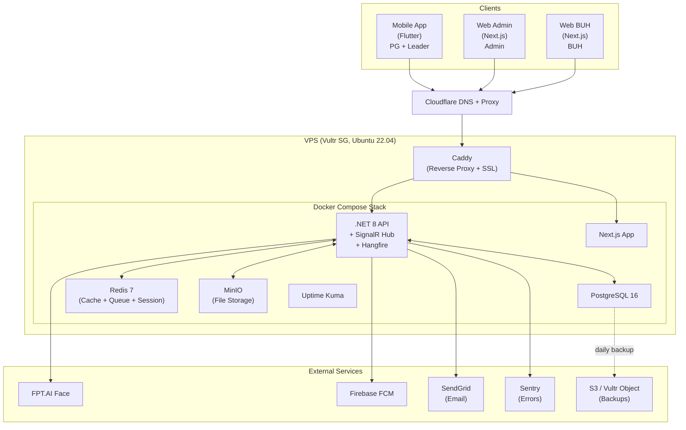
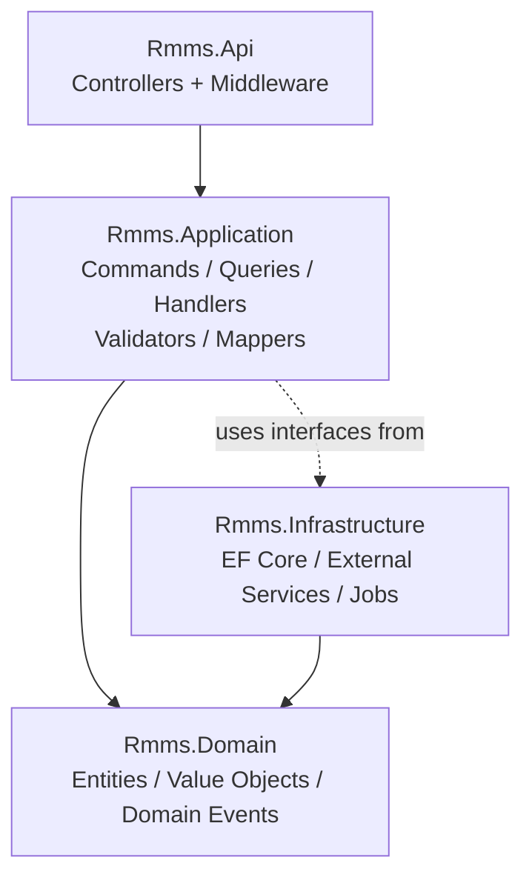
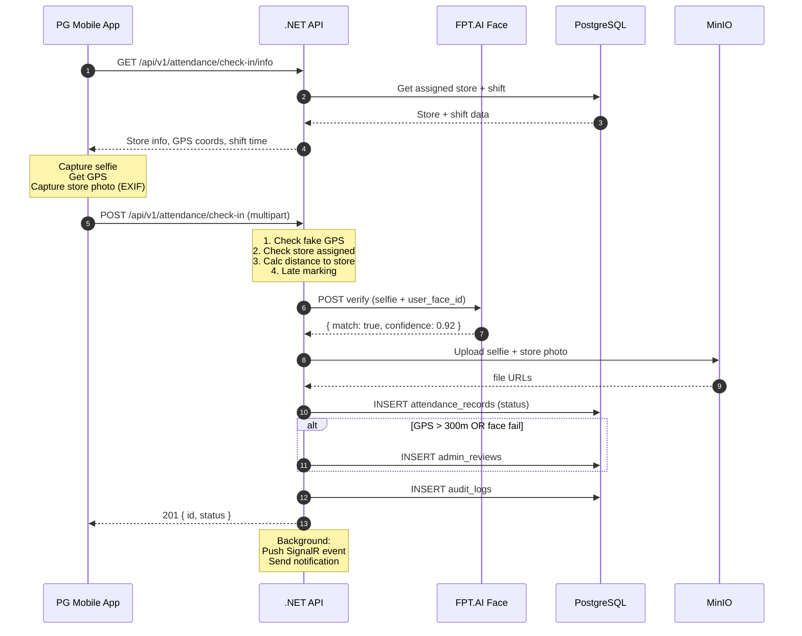
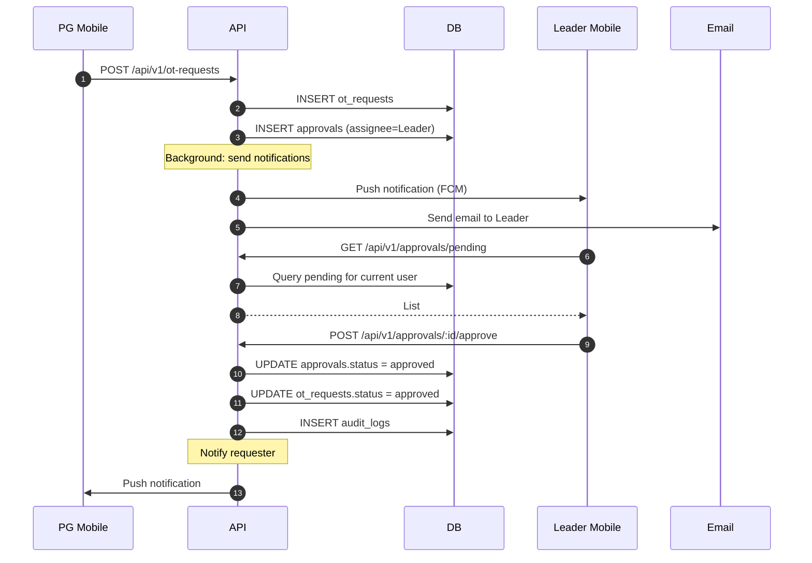
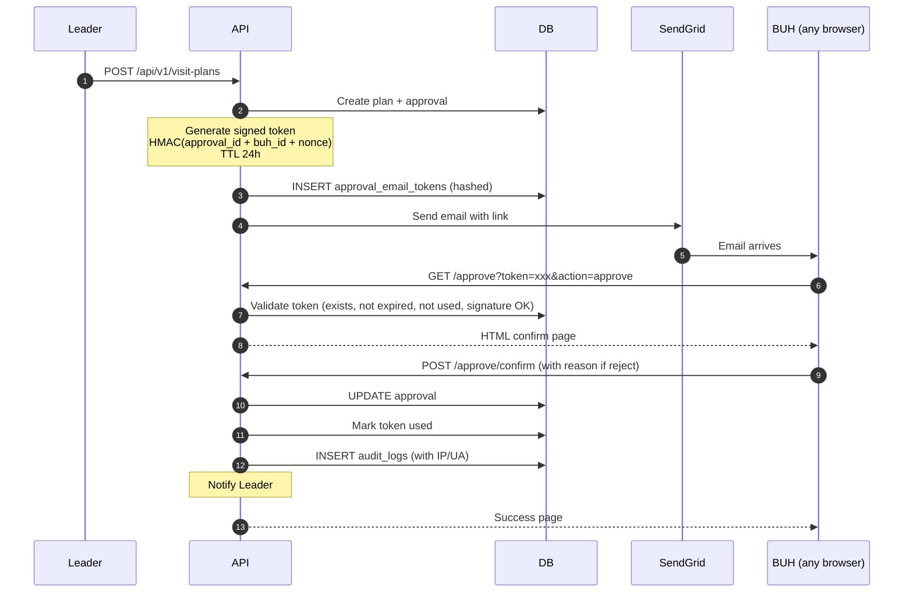
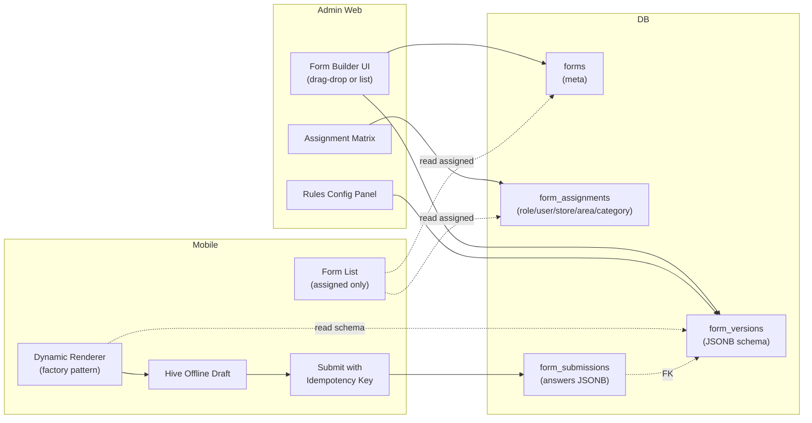
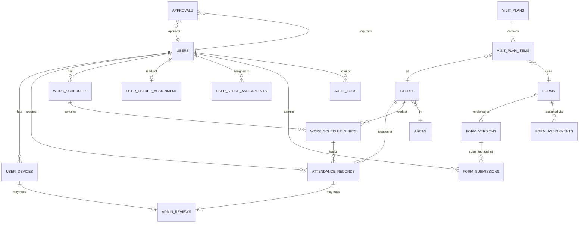
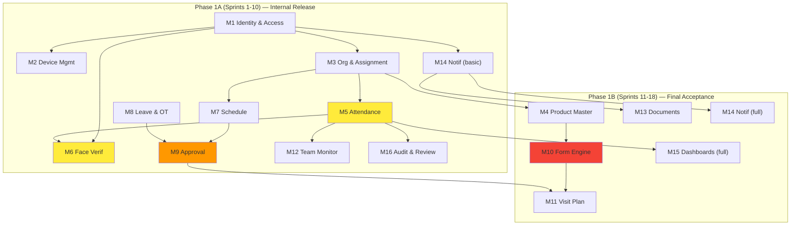
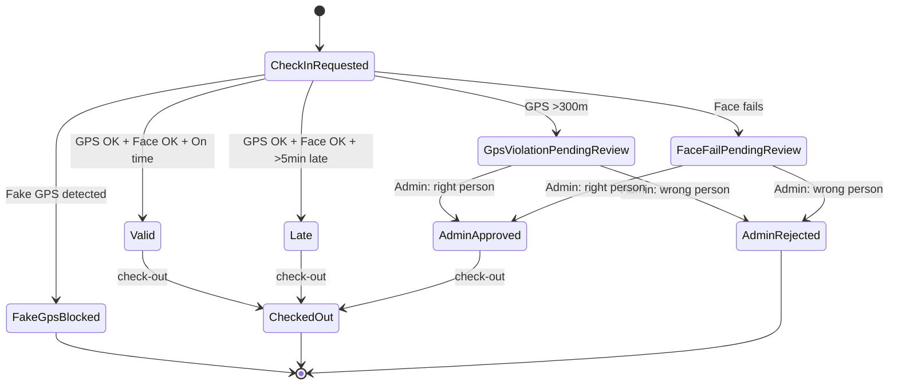
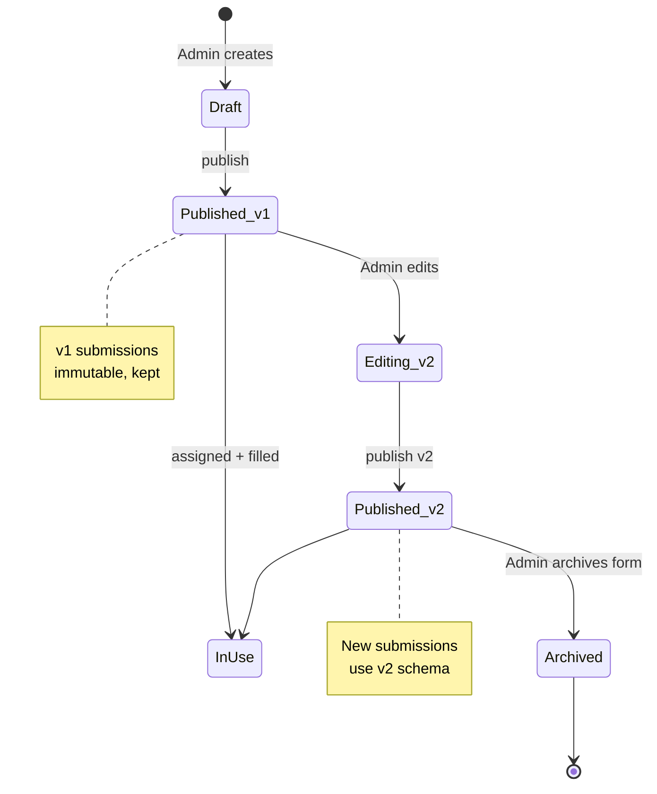

# Diagrams

Mermaid source for architecture diagrams. Render at https://mermaid.live or in Markdown viewers that support Mermaid (GitHub, GitLab, Obsidian, Notion).

## 1. System Architecture



## 2. Backend Layered Architecture



## 3. Check-in Sequence



## 4. Approval Workflow



## 5. BUH Email-Link Approval



## 6. Form Engine Architecture



## 7. Entity Relationship (simplified)



## 8. Phase 1A vs Phase 1B Module Map



## 9. Attendance Status State Machine



## 10. Form Version Lifecycle



## How to Render

### GitHub / GitLab
Just commit `.md` files; they render automatically.

### Local preview
```bash
npx @mermaid-js/mermaid-cli -i diagrams.md -o output.png
```

### Online
Copy each ` ```mermaid ... ``` ` block to https://mermaid.live

### Export to SVG
```bash
mmdc -i diagram.mmd -o diagram.svg
```
